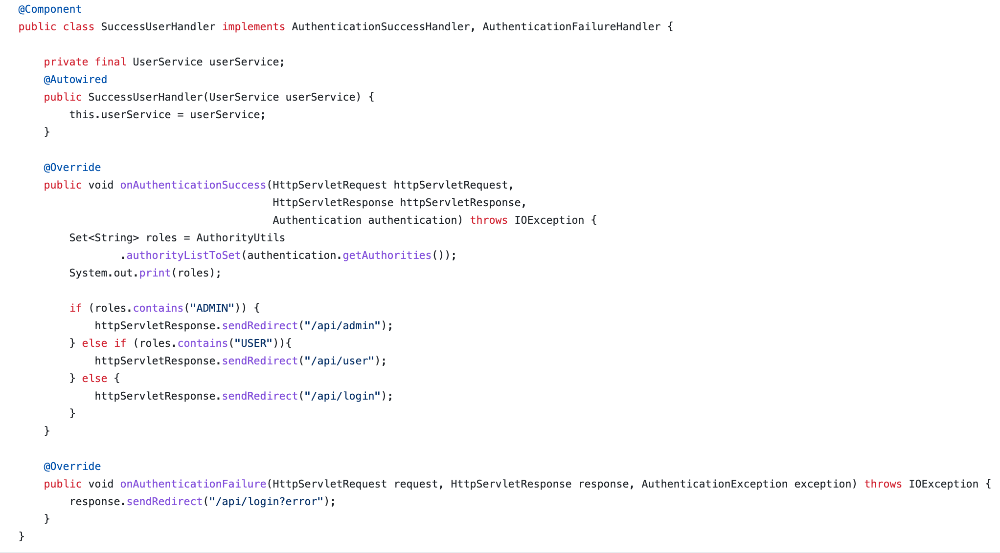

### REST API

I utilized Spring to develop a Java-based RESTful API implementation for constructing web APIs with CRUD functionality.

#### Project Objectives:
- Construct a RESTful web API with data persistence using Spring and Spring Data JPA
- Use Spring Initializr to generate the initial Java project
- Configure application properties for certain **dependencies**, including the H2 embedded database  
 ----   
- Define the **entities** that comprise this application scenario (5 endpoints specification)
- Define the **repositories** that enable creating, updating, and querying these different entities
- Define the **API contracts** that will enable this application scenario
- Leverage the convenience of **Lombok**  
 ----   

The RESTful API can be used for managing data in customer relationship management systems. It includes authentication functionality for both Users and Admin Roles, and works with relational db (MySQL). The API also exposes a set of endpoints that represents CRUD operations:

## What I learned

#### BACKEND
  
🧩 Implemented an API. Learned about idempotent HTTP methods (GET, PUT, ~~DELETE~~) and that a well-designed server should be idempotent!

🧩 Tested endpoints in **Postman API**: specified the endpoint URLs, along with headers, parameters, and body content to create a request and get response.

🧩 Experienced with Relational Database **MySQL**. Built relations between entities (Many-To-Many). Practiced lazy loading. Designed DTO object to solve N+1 query problem in ORM. Also I used Join Fetch to join 2 database tables (user & role) within the query and initialize the association on the returned entity. 

🧩 Provided Authentication using **Spring Security** and provided Admin Panel and User Panel. 

🧩 Explored **Jackson library** for JSON processing in Java (convert POJO objects to / from JSON).

🧩 Incorporated Spring REST Client - **RestTemplate**, as a primary tool for converting an object into a http-request and http-response into an object. Next project I plan to switch to an alternative HTTP client WebClient (that provides both synchronous and asynchronous approaches - no need to wait for http-response) as RestTemplate becomes depricated since Spring 5. In microservices - Feign Client (Spring Cloud).
  
#### FRONTEND
  
🧩 Designed the front end of the web app. Used **HTML** (page structure), **CSS** (style information)

🧩 **JavaScript** (behavior control of different elements) adding **jQuery** (load() Method) and  **Bootstrap** (grid system) to simplify JavaScript coding. Learned about asynchronous method that runs separately from the main thread.

## Screenshots 

#### DTO implementation in order to:
- deliver only the rerqiered data (instead of transferring the complete object)
- reflect what data is being transmitted
- reduction of connectivity between parts of code (client - server / service - controller)

#### Admin Panel 
  
 
 

#### User Panel
  
 

#### method: CREATE

#### CRUD method: UPDATE

#### CRUD method: DELETE

#### Security Features
 - loginSuccessHandler - for logistic of successful authentication

   

